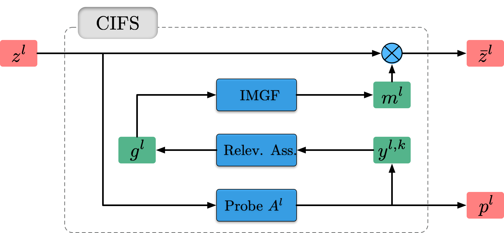

# CIFS
This repository provides codes for [CIFS](https://arxiv.org/abs/2102.05311) (ICML 2021).

CIFS: Improving Adversarial Robustness of CNNs via Channel-wise Importance-based Feature Selection  
Hanshu Yan, Jingfeng Zhang, Gang Niu, Jiashi Feng, Vincent Y. F. Tan, Masashi Sugiyama

## Requirements
Python = 3.6  
Pytorch = 1.6  
CUDA = 10.1  
Advertorch = 0.2.3

## Channel-wise Importance-based Feature Selection

    

 CIFS: 1) Probe Network A^l first makes a raw prediction p^l for z^l. 2) Channels’ relevances g^l are assessed (Relev. Ass.) based on the gradients of the top-k prediction results y^{l,k}. 3) The IMGF generates an importance mask m^l from g^l for channel adjustment.

